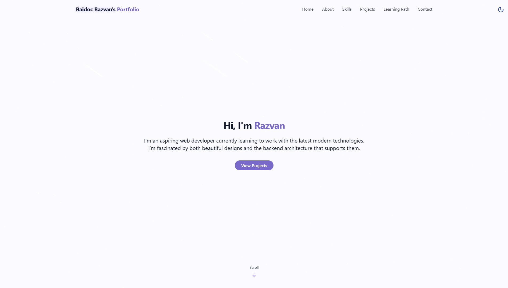
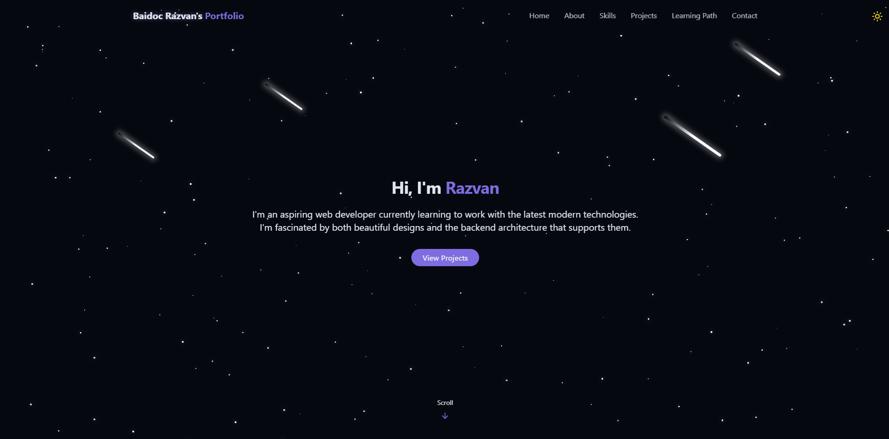

# Razvan's Developer Portfolio

A modern, interactive single-page portfolio showcasing my skills, projects, and learning journey. Features a dynamic cosmic theme with randomly generated stars and meteors, theme switching, and responsive design.

## 🚀 Live Deploy

[View live site](https://baidocrazvan.com)

---

## Table of Contents

- [Key Features](#-key-features)
- [Screenshots/Vids](#screenshotsvids--click-to-expand)
- [Technologies Used](-technologies-used)
- [Installation & Setup](-installation--setup)
- [Special Components](-special-components)
- [Design Principles](#-design-principles)
- [Customizing content](#-customizing-content)
- [Deployment](-deployment-vercel)
- [License](#license)

---

## ✨ Key Features

- **Cosmic Interactive Background**

  - Randomly generated stars with varying sizes and opacity
  - Animated shooting meteors
  - Recalculates on resize

- **Dynamic Theme System**

  - Light/dark mode toggle with localStorage persistence
  - System preference detection
  - Smooth transitions between themes

- **Interactive Components**

  - Flippable skill cards with proficiency levels
  - Animated project gallery
  - Expandable learning path timeline
  - Functional contact form with toast notifications

- **Responsive Design**
  - Mobile-first approach
  - Adaptive navbar (mobile hamburger menu)
  - Responsive image loading

---

## Screenshots/Vids 📷 (Click to Expand)

<details>
<summary>🏠 Hero Section (Desktop)</summary>
  
*Default light mode view*    

  
*Dark mode variant*
  

</details>

<details>
<summary>🌔Theme Toggle</summary>

  
https://github.com/user-attachments/assets/e3b0e22e-2390-41a9-90de-5fd9c7c309ce


</details>

<details>
<summary>⚙️ Skills Section</summary>

  
https://github.com/user-attachments/assets/32783caf-ef1d-4580-96ae-c8f88526bcc1


</details>

<details>
<summary>🌌 Background Effect (Randomly generated stars & meteors)</summary>

  
https://github.com/user-attachments/assets/c239e0a4-050a-40b0-b036-2803bcfe8b12


</details>

<details>
<summary>📧 Contact Section</summary>


https://github.com/user-attachments/assets/c5534e8e-e20f-450a-85be-146efdd05f0b


</details>

---

## 💡 Technologies Used

- **Frontend**

  - React + Vite
  - Tailwind CSS
  - Lucide React (icons)
  - Radix UI (toast notifications)

- **Backend Services**
  - EmailJS (contact form)
  - Environment variables for configuration

## 🔧 Installation & Setup

1. **Clone the repository**
   ```
   git clone https://github.com/baidocrazvan/React-Portfolio.git
   cd React-Portfolio
   ```
2. **Install the dependencies**
   ```
   npm install
   ```
3. **Set up environment variables**
   Create an .env file with your own email service information. Everything works without these, but you won't be able to receive any emails from the contact form

   Example using EmailJS service:

   ```
   VITE_EMAILJS_SERVICE_ID=your_service_id
   VITE_EMAILJS_TEMPLATE_ID=your_template_id
   VITE_EMAILJS_PUBLIC_KEY=your_public_key
   ```

4. **Run development server**
   ```
   npm run dev
   ```

---

## 🌌 Special Components

- **StarBackground**

  - Generates random stars based on viewport size
  - Creates 4 animated meteors with random trajectories
  - Uses CSS animations for smooth performance

  ```jsx
  // Example star generation
  {
  id: i,
  size: Math.random() * 3 + 1, // 1-4px
  x: Math.random() * 100,      // 0-100% viewport
  y: Math.random() * 100,
  opacity: Math.random() * 0.5 + 0.5 // Star opacity 50(faint)-100%
  animationDuration: Math.random() * 4 + 2, // Pulsating animation duration (2s-6s)
  }
  ```

- **ThemeToggle**

  - Toggle between light/dark modes
  - Persists user preference in localStorage

  ```css
  /* HSL-based theme variables */
  .dark {
    --card: 222 47% 8%; /* Deep space blue */
    --background: 222 47% 4%;
  }
  ```

---

## 🎨 Design Principles

    - Color System: HSL-based theming with Tailwind
    - Animations: Custom CSS keyframes for performance
    - Responsive: Mobile-first fluid layouts
    - Accessibility:
        - Keyboard navigable
        - ARIA labels for interactive elements

---

## 📝 Customizing Content

    - Edit the data files to update your information:
        - Skills: src/data/skillsData.js
        - Projects: src/data/projectsData.js
        - Learning Path: src/data/learningPathData.js

---

## 🚀 Deployment (Vercel)

1. Connect your GitHub repository to Vercel
2. Add these environment variables (if you want working contact form):
   - `VITE_EMAILJS_SERVICE_ID`
   - `VITE_EMAILJS_TEMPLATE_ID`
   - `VITE_EMAILJS_PUBLIC_KEY`
3. Add `vercel.json` for SPA routing:
   ```json
   {
     "rewrites": [{ "source": "/(.*)", "destination": "/" }]
   }
   ```

---

## License

This project is licensed under the MIT License. See the [LICENSE](LICENSE) file for details.

---
